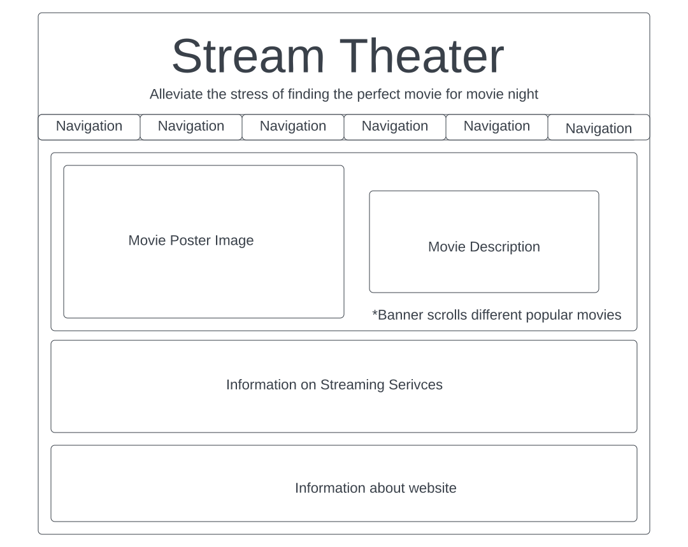
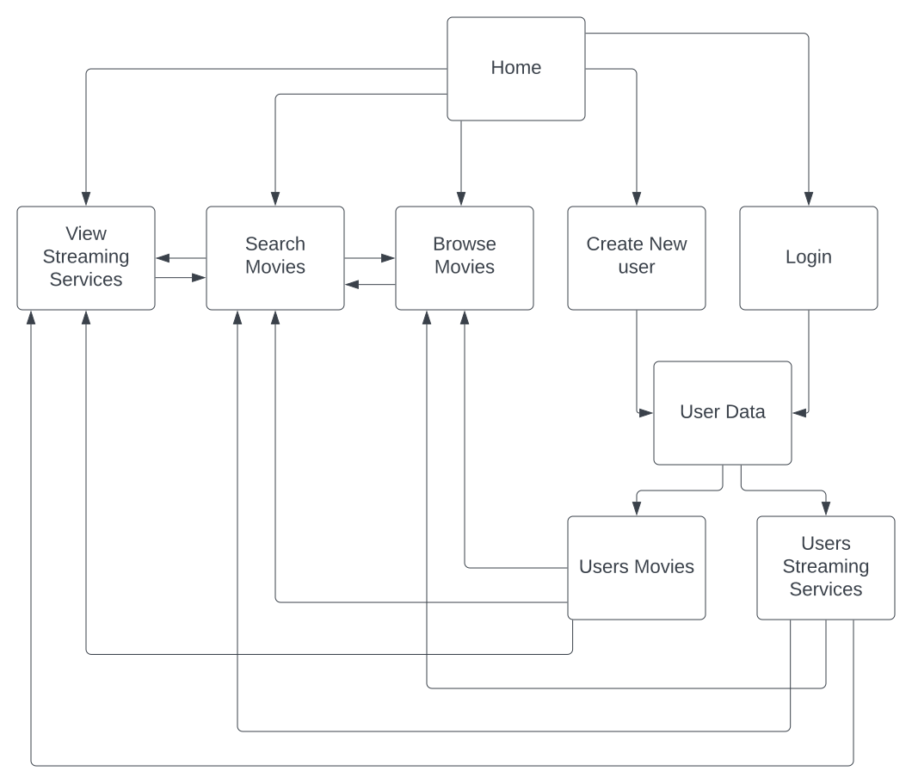

# Stream Theater

Description
-----------
It seems like in todays world, whenever you decide you want to see a specific movie, it turns out that you are paying for the wrong streaming service, the streaming service that does not have the movie you want. On the flip side, if you just want to try something new and start browsing for a movie to watch on your streaming service, you spend hours and cannot find anything that seems interesting. Therefore, I want to create a website that allows you to either find your favorite movies or explore new movies, learn a bit about them, and then find a streaming service in which you could immediately watch which ever movie you wanted. Using the Open Movie Database, users can search or browse through a large database of movies, they can see IMDb information, movie title, year of movie, plot of movie, and much more. Then using the data provided by Watchmode, users can tell which streaming platform they can currently watch that movie on. All in all, this website can take a lot of the guess and check, and the disappointment out of sitting through a bad movie, out of your next movie or date night.

## Web Services
- [Watchmode](https://api.watchmode.com/) -- apiKey (Need personal API key for links to work)
  - Service: Search API 
      - URL w/ Example: 'https://api.watchmode.com/v1/search/?apiKey=YOUR_API_KEY&search_field=name&search_value=Ed%20Wood'
      - METHOD: GET
  - Service: Title Details API 
      - URL: 'https://api.watchmode.com/v1/title/345534/details/?apiKey=YOUR_API_KEY'
      - METHOD: GET
  - Service: Title Sources API
      - URL: 'https://api.watchmode.com/v1/title/345534/sources/?apiKey=YOUR_API_KEY' 
      - METHOD: GET
   - Service: List Titles API
      - URL w/ Example: 'https://api.watchmode.com/v1/list-titles/?apiKey=YOUR_API_KEY&source_ids=203,57' 
      - METHOD: GET
- [Open Movie Database](https://www.omdbapi.com/) -- apiKey (Need personal API key for links to work)
  - Service: ID or Title API 
      - URL: http://www.omdbapi.com/?apikey=[yourkey]&
      - METHOD: GET

Database use
------------
My plan for database use includes a 'Users' table, 'Movies' table, and a 'Services' table. The Users table will store information about the user that is actually using the website. It will store, or we will write to it, personal information and it will link to the other tables by allowing a user to enter which streaming services they have, and perhaps allow them to add some of their favorite movies. The Movies table will be used to get all the information about movies that a user may be interested in. It will contain movie title, movie year, a brief description, and more. The movies table will connect to the the Services table to show which movies are located on which streaming services. Finally, the Services table will contain the information regarding the Streaming services, such as Netflix, Hulu, etc. It will link with movies to show which movies are available on each service and connect to users to show which users have each service.

Initial design
-------------

#### Layout

 
 
 #### Site map
 
